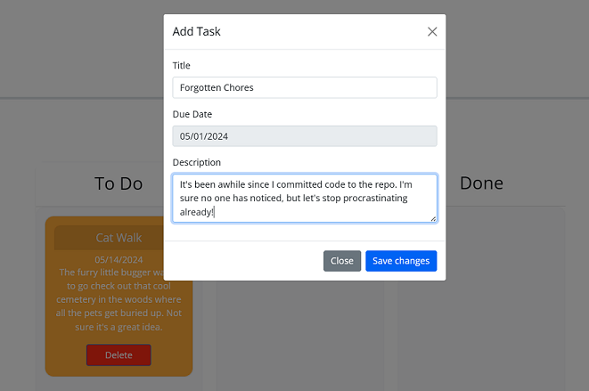
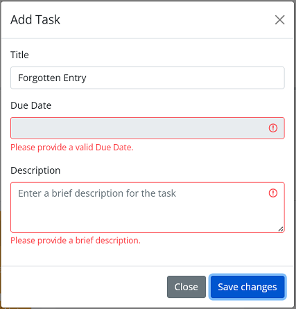

# Task Board

## Description

A simple task board application that allows a team to manage project tasks. This app will run in the browser and feature dynamically updated HTML and CSS powered by jQuery.

### The Task Board

### Adding a Task

### Adding a Task Validation

### Populated Swim Lanes

## Table of Contents

- [Installation](#installation)
- [Usage](#usage)
- [Credits](#credits)
- [License](#license)

## Installation

You may clone the repository for access to the project files directly to copy/paste as needed. You may also fork the repository to utilize git actions to deploy as needed to support your workflows.

Since this is a static code project it may be deployed on any hosting platform supporting static code projects supporting html, css, and javascript including cloud providers:

- [AWS](https://aws.amazon.com/getting-started/hands-on/host-static-website/)
- [Azure](https://learn.microsoft.com/en-us/azure/static-web-apps/getting-started?tabs=vanilla-javascript)
- [Google Cloud](https://cloud.google.com/storage/docs/hosting-static-website)

Additionally, if your preference is more hands-on, you can deploy manually to:

- [IIS](https://learn.microsoft.com/en-us/iis/manage/creating-websites/scenario-build-a-static-website-on-iis)
- [Apache Tomcat](https://tomcat.apache.org/tomcat-9.0-doc/appdev/deployment.html)
- [Apache Http](https://fullstackdeveloper.guru/2021/04/08/how-to-deploy-html-javascript-code-to-apache-http-server/)

Or:

### Run with Docker

- clone the repo `git clone https://github.com/ericroys-school/task-board.git`
- cd into the repo `cd task-board`
- run `docker build -t tboard:latest . && docker run -d -p 9001:80 --name tboard tboard`
  _note_: choose a port other than 9001 if you wish
- open your browser to `http://localhost:9001`

## Usage

This web project is currently deployed [on Github Pages](https://ericroys-school.github.io/task-board)

## Credits

I would like to thank my bearded dragons for the timely distractions to support proper posture and work-life balance.

## License

This project is licensed with the "Unlicense" license. [(Read more here)](LICENSE)

## How to Contribute

Thank you, but we are not seeking any contributions at this time.

## Tests

The project was unit tested while being developed. Automated testing will be added in future projects.
